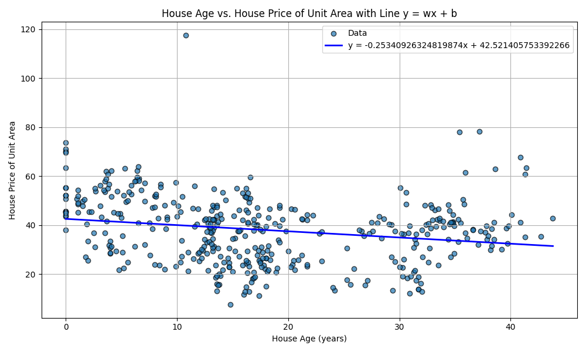
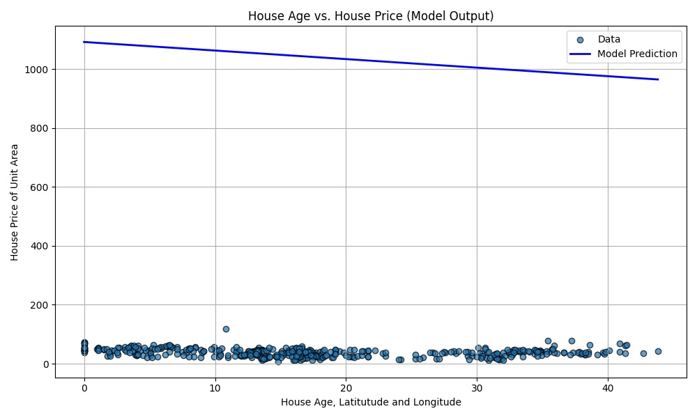

This is my first time trying machine learning algorithms, so there may be several mistakes or whole logic may be wrong.

<h2>About Data</h2>
<ol>
  <li><a href="https://github.com/bp2881/machinelearning-algo/blob/master/RealEstate.csv">Real Estate dataset</a></li>
  <ul>
    <li>rows - 411, columns - 7</li>
    <li>trainset - (1, 375) [375], testset - (376, 411) [36]</li>
  </ul>
  <li><a href="https://github.com/bp2881/machinelearning-algo/blob/master/cancer.csv">Cancer dataset</a></li>
  <ul>
    <li>rows - 553, columns - 32</li>
    <li>trainset - (1, 500) [500], testset - (501, 553) [53]</li>
  </ul>
</ol>

<h2>Linear Regression with one variable</h2>
<ul>
  <li>Considered <a href="https://github.com/bp2881/machinelearning-algo/blob/master/RealEstate.csv">Real Estate dataset</a></li>
  <li>Considered <b>X2 house age</b> as input factor and <b>Y house price</b> as output factor</li>
  <li>Current optimal line => y = -11.0365x + 42.4959</li>
  <li>learning rate - 0.01, iterations - 10k</li>
  <li>Prediction cost on test cases - <b>69.5</b></li>
  
</ul>

<h2>Linear Regression with multiple variables</h2>
<ul>
  <li>Considered <a href="https://github.com/bp2881/machinelearning-algo/blob/master/RealEstate.csv">Real Estate dataset</a></li>
  <li>Considered <b>X2 house age, X3 distance to the nearest MRT station, X4 number of convenience stores</b> as input factors and <b>Y house price of unit area</b> as output factor</li>
  <li>Current optimal line => y = -7.7655x + 41.0573</li>
  <li>learning rate - 0.0003, iterations - 100k</li>
  <li>Prediction cost on test cases - <b>16.03</b></li>
  
</ul>

<h2>RESOURCES:</h2>
<ul>
  <li><a href="https://www.coursera.org/specializations/machine-learning-introduction">Machine Learning Specialization</a> - by Andrew Ng</li>
  <li><a href="https://www.youtube.com/playlist?list=PLqnslRFeH2Upcrywf-u2etjdxxkL8nl7E">Machine Learning from scratch</a> - by Patrick Loeber</li>
</ul>

<h2>TODO:</h2>
<ol>
  <li>Recheck core logic</li>
  <li>Remove outliers</li>
  <li>Complete Polynomial Regression</li>
  <li>Update README to include Logistic Regression and Polynomial Regression</li>
</ol>
