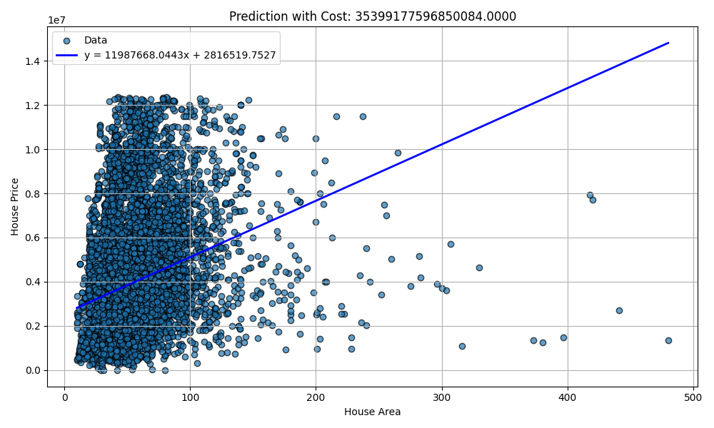
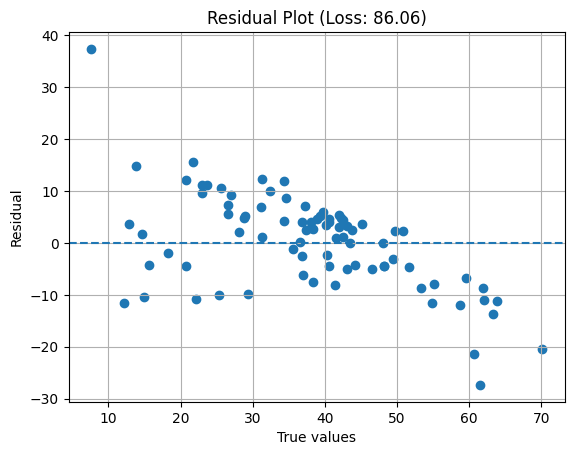
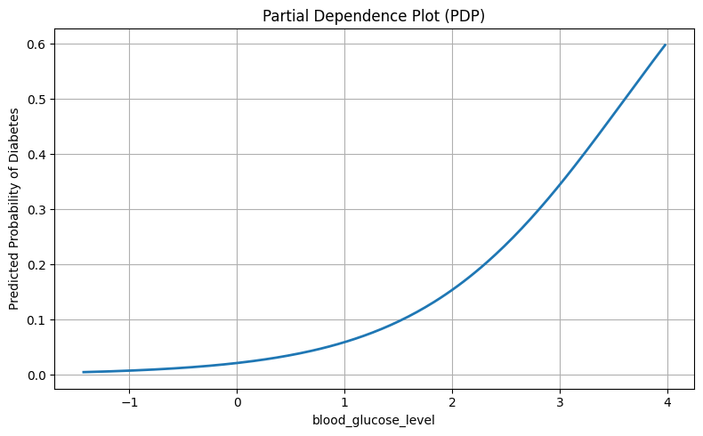

This is my first time trying machine learning algorithms, so there may be several mistakes or whole logic may be wrong. 

<h2>About Data</h2>
<ol>
  <li><a href="https://github.com/bp2881/machinelearning-algo/blob/pytorch/RealEstate.csv">Real Estate dataset</a></li>
  <ul>
    <li>rows - 411, columns - 7</li>
    <li>trainset - 80%, testset - 20%</li>
    <li>Used features have been normalized using z-score in dataset</li>
  </ul>
  <li><a href="https://github.com/bp2881/machinelearning-algo/blob/pytorch/cancer.csv">Cancer dataset</a></li>
  <ul>
    <li>rows - 553, columns - 32</li>
    <li>trainset - 80%, testset - 20%</li>
  </ul>
</ol>

<h2>Linear Regression with one variable (underfit)</h2>
<ul>
  <li>Considered <a href="https://github.com/bp2881/machinelearning-algo/blob/pytorch/RealEstate.csv">Real Estate dataset</a></li>
  <li>Considered <b>"X3 distance to the nearest MRT station"</b> as input feature and <b>"Y house price"</b> as output factor</li>
  <li>Current optimal line => y = -9.43x + 37.88</li>
  <li>learning rate - 0.01, iterations - 300</li>
  <li>Prediction cost on test cases - <b>102.47</b></li>
  
</ul>

<h2>Linear Regression with multiple variables (slightly underfit)</h2>
<ul>
  <li>Considered <a href="https://github.com/bp2881/machinelearning-algo/blob/pytorch/RealEstate.csv">Real Estate dataset</a></li>
  <li>Considered <b>"X2 house age", "X3 distance to the nearest MRT station", "X4 number of convenience stores"</b> as input features and <b>"Y house price of unit area"</b> as output factor</li>
  <li>Current optimal line => y = -3.09x1 - 7.08x2 + 3.70x3 + 37.94</li>
  <li>learning rate - 0.01, iterations - 300</li>
  <li>Prediction cost on test cases - <b>86.03</b></li>
  
</ul>

<h2>Logistic Regression (best fit)</h2>
<ul>
  <li>Considered <a href="https://github.com/bp2881/machinelearning-algo/blob/pytorch/diabetes_prediction_dataset.csv">Diabetes Prediction Dataset</a></li>
  <li>Considered <b>"age"</b>, <b>"bmi"</b>, <b>"HbA1c_level"</b>, <b>"blood_glucose_level"</b> as input features and <b>"diabetes"</b> as output factor</li>
  <li>Used Sigmoid Activation Function</li>
  <li>Current optimal curve => z = 0.79x1 + 0.46x2 + 1.51x3 + 1.06x4 - 3.83</li>
  <li>learning rate - 0.01, iterations - 10k</li>
  <li>Testing Loss: <b>0.1265</b>, Accuracy: <b>95.77</b></li>
  
  <br>
  ```bash
  The PDP does not necessarily span the full probability range because other features are fixed at their mean values, limiting the maximum achievable logit
  ```
</ul>

<h2>TODO:</h2>
<ul>
  <li>LinearRegression_mv is currently biased, fix that, EDIT: residual plot shows a pattern</li>
  <li>Update README in next commit</li>
</ul>

<h2>RESOURCES:</h2>
<ul>
  <li><a href="https://www.coursera.org/specializations/machine-learning-introduction">Machine Learning Specialization</a> - by Andrew Ng</li>
  <li><a href="https://www.youtube.com/playlist?list=PLqnslRFeH2Upcrywf-u2etjdxxkL8nl7E">Machine Learning from scratch</a> - by Patrick Loeber</li>
</ul>
